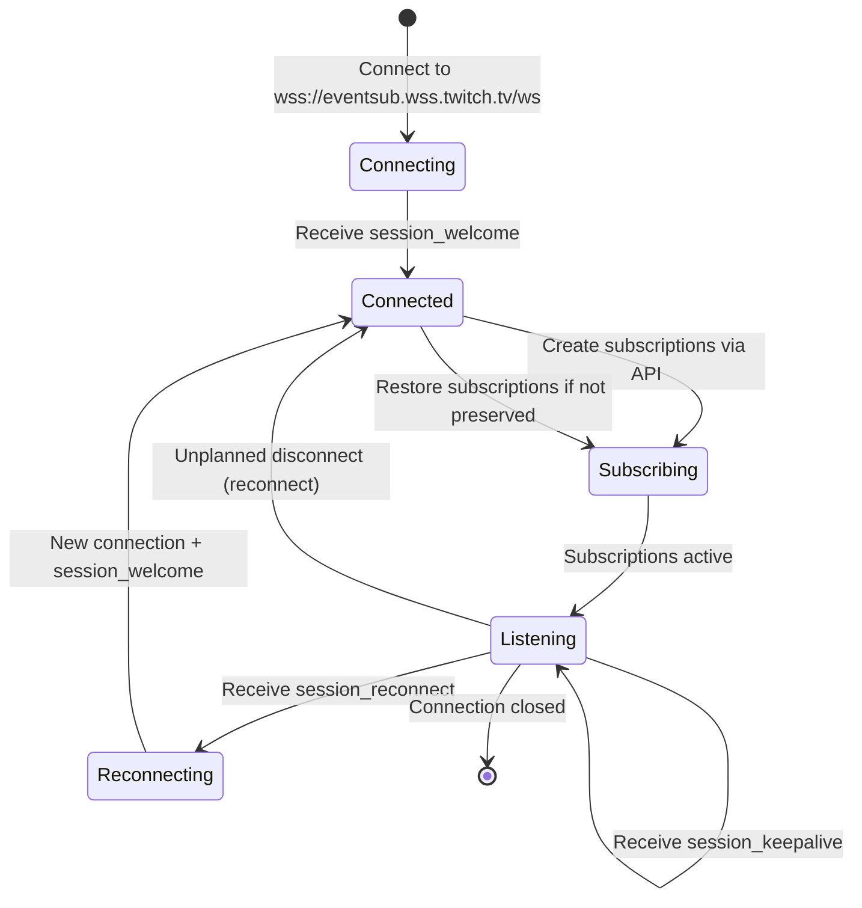

# Twitch WebSocket APIs - Comprehensive Research Document

**Document Version:** 1.0  
**Research Date:** 2026-01-22  
**Status:** Current  

## Executive Summary

This document provides extremely comprehensive research on all Twitch WebSocket APIs, including:

1. **Twitch PubSub** - DEPRECATED (Shutdown: April 14, 2025)
2. **Twitch EventSub WebSocket** - CURRENT (Replacement for PubSub)
3. **Twitch IRC WebSocket** - CURRENT (For chat functionality)

**CRITICAL NOTE:** Twitch PubSub has been fully deprecated and decommissioned. The current recommended approach for real-time events is **EventSub over WebSocket**. This document includes PubSub information for historical reference and migration purposes only.

---

## TABLE OF CONTENTS

1. [Twitch PubSub (Deprecated)](#1-twitch-pubsub-deprecated)
   - [Deprecation Notice](#deprecation-notice)
   - [Connection Protocol](#pubsub-connection-protocol)
   - [Topics Reference](#pubsub-topics-reference)
   - [Message Format](#pubsub-message-format)
   - [Migration Guide](#pubsub-to-eventsub-migration-guide)
2. [Twitch EventSub WebSocket (Current)](#2-twitch-eventsub-websocket-current)
   - [Connection Protocol](#eventsub-connection-protocol)
   - [Message Types](#eventsub-message-types)
   - [Subscription Management](#eventsub-subscription-management)
   - [Event Type Reference](#eventsub-event-type-reference)
   - [Connection Lifecycle](#eventsub-connection-lifecycle)
3. [Twitch IRC WebSocket (Current)](#3-twitch-irc-websocket-current)
   - [Connection Protocol](#irc-connection-protocol)
   - [Authentication](#irc-authentication)
   - [IRC Commands](#irc-commands)
   - [IRC Tags](#irc-tags)
   - [Message Types Reference](#irc-message-types-reference)
4. [API Comparison Matrix](#4-api-comparison-matrix)
5. [Event Type Mapping](#5-event-type-mapping)
6. [Code Examples](#6-code-examples)
    - [EventSub WebSocket TypeScript Examples](#eventsub-websocket-typescript-examples)
    - [Twitch IRC TypeScript Examples](#twitch-irc-typescript-examples)
    - [Using Existing Libraries](#using-existing-libraries)
7. [Best Practices](#7-best-practices)
8. [Data Structure Comparison](#8-data-structure-comparison)
9. [Rate Limits and Quotas](#9-rate-limits-and-quotas)

---

# 1. TWITCH PUBSUB (DEPRECATED)

## Deprecation Notice

⚠️ **CRITICAL:** Twitch PubSub is deprecated and was fully decommissioned on **April 14, 2025**.

### Timeline:
- **April 2024:** PubSub officially marked as deprecated
- **April 14, 2025:** PubSub fully decommissioned and shut down
- **Current Status:** Use EventSub WebSocket instead

### Migration Resources:
- [Official Migration Guide](https://dev.twitch.tv/docs/pubsub/)
- Topic Equivalence Table: See [PubSub to EventSub Migration Guide](#pubsub-to-eventsub-migration-guide)

**Why included in this document?** For historical reference and to understand what PubSub provided when migrating to EventSub.

---

## PubSub Connection Protocol

### WebSocket Endpoint
```text
wss://pubsub-edge.twitch.tv
```

### Authentication Requirements
PubSub required JWT (JSON Web Token) authentication for most topics.

**Token Types:**
- **User Access Token** - For channel-specific subscriptions
- **App Access Token** - For some client-global events (rare)

**Required Scopes (by topic type):**
- `channel:read:redemptions` - Channel points topics
- `bits:read` - Bits events
- `channel:read:subscriptions` - Subscription events
- `channel:moderate` - Moderation topics
- `chat:read` - Chat topics

### Connection Handshake Protocol

1. **Connect to WebSocket endpoint**
2. **Send LISTEN message to subscribe to topics**
3. **Receive RESPONSE confirming subscription**
4. **Receive MESSAGE events for subscribed topics**
5. **Send PONG in response to PING for keepalive**
6. **Handle RECONNECT when server requests**

### Keepalive/Ping-Pong Mechanism

**Server sends PING:** Every 4 minutes (approximately)

**Client must respond with PONG:** Same format as received PING message

**Keepalive timeout:** If no PING received within 5 minutes, consider connection dead and reconnect.

### Reconnection Strategy

1. **Unplanned disconnect:** Wait exponentially increasing delays (1s, 2s, 4s, 8s, 16s, 32s, max 60s)
2. **RECONNECT message:** Use provided reconnect URL immediately
3. **State preservation:** Must resubscribe to all topics after reconnect

### Topic Subscription Protocol

**LISTEN message format:**
```json
{
  "type": "LISTEN",
  "nonce": "<unique-string>",
  "data": {
    "topics": ["<topic1>", "<topic2>"],
    "auth_token": "<oauth-token>"
  }
}
```

**UNLISTEN message format:**
```json
{
  "type": "UNLISTEN",
  "nonce": "<unique-string>",
  "data": {
    "topics": ["<topic1>"]
  }
}
```

---

## PubSub Topics Reference

While PubSub is deprecated, this reference is provided for understanding what functionality it provided that now exists in EventSub.

### Channel-Related Topics

#### `channel-bits-events-v1.<channel_id>` (DEPRECATED)
**Replaced by:** EventSub `channel.cheer` + `channel.chat.message`

**Purpose:** Notifications for cheers (bits) in a channel

**Payload Example:**
```json
{
  "type": "MESSAGE",
  "data": {
    "topic": "channel-bits-events-v1.123456789",
    "message": "{\"data\":{\"user_name\":\"TestUser\",\"user_id\":\"987654321\",\"channel_name\":\"TestChannel\",\"channel_id\":\"123456789\",\"time\":\"2023-01-15T10:30:00Z\",\"bits_used\":100,\"total_bits_used\":500,\"is_anonymous\":false,\"message\":\"cheer100\"},\"version\":\"1.0\"}"
  }
}
```

**Payload Fields:**
| Field | Type | Required | Description |
|-------|------|----------|-------------|
| user_name | string | Yes | Display name of user who cheered |
| user_id | string | Yes | User ID of the cheerer |
| channel_name | string | Yes | Channel name |
| channel_id | string | Yes | Channel ID |
| time | string (ISO8601) | Yes | Timestamp of cheer |
| bits_used | number | Yes | Number of bits in this cheer |
| total_bits_used | number | Yes | Total bits user has cheered in channel |
| is_anonymous | boolean | Yes | Whether cheer was anonymous |
| message | string | Yes | Cheer message with bits |

**Migration Path:**
- Use EventSub `channel.cheer` for cheer details
- Use EventSub `channel.chat.message` for chat message with `bits` tag

---

#### `channel-bits-events-v2.<channel_id>` (DEPRECATED)
**Replaced by:** EventSub `channel.bits.use`

**Purpose:** Enhanced bits events with more details

**Payload Example:**
```json
{
  "type": "MESSAGE",
  "data": {
    "topic": "channel-bits-events-v2.123456789",
    "message": "{\"data\":{\"user_id\":\"987654321\",\"user_login\":\"testuser\",\"user_name\":\"TestUser\",\"broadcaster_user_id\":\"123456789\",\"broadcaster_user_login\":\"testchannel\",\"broadcaster_user_name\":\"TestChannel\",\"bits\":100,\"total_bits\":500,\"message\":\"cheer100\",\"message_id\":\"abc-123-def\",\"is_anonymous\":false},\"version\":\"2.0\"}"
  }
}
```

**Migration Path:**
- Use EventSub `channel.bits.use` (includes Power-ups and Combos)

---

#### `channel-subscribe-events-v1.<channel_id>` (DEPRECATED)
**Replaced by:** Multiple EventSub subscription types:
- `channel.subscribe` - New subscriptions (not resubs)
- `channel.subscription.message` - Resubscription with chat message
- `channel.subscription.gift` - Gifted subscriptions
- `channel.subscription.end` - Subscription ended

**Purpose:** Notification of new subscriptions to a channel

**Payload Example:**
```json
{
  "type": "MESSAGE",
  "data": {
    "topic": "channel-subscribe-events-v1.123456789",
    "message": "{\"data\":{\"user_name\":\"TestUser\",\"user_id\":\"987654321\",\"channel_name\":\"TestChannel\",\"channel_id\":\"123456789\",\"time\":\"2023-01-15T10:30:00Z\",\"sub_plan\":\"Prime\",\"sub_plan_name\":\"Prime\",\"is_gift\":false},\"version\":\"1.0\"}"
  }
}
```

**Payload Fields:**
| Field | Type | Required | Description |
|-------|------|----------|-------------|
| user_name | string | Yes | Subscriber's display name |
| user_id | string | Yes | Subscriber's user ID |
| channel_name | string | Yes | Channel name |
| channel_id | string | Yes | Channel ID |
| time | string (ISO8601) | Yes | Timestamp |
| sub_plan | string | Yes | Subscription plan: "Prime", "1000", "2000", "3000" |
| sub_plan_name | string | Yes | Display name of subscription plan |
| is_gift | boolean | Yes | Whether subscription is a gift |

**Migration Path:**
- New subs: EventSub `channel.subscribe`
- Resubs (with message): EventSub `channel.subscription.message`
- Gifted subs: EventSub `channel.subscription.gift`
- Sub ends: EventSub `channel.subscription.end`

---

#### `channel-points-channel-v1.<channel_id>` (DEPRECATED)
**Replaced by:** EventSub channel points redemption events:
- `channel.channel_points_custom_reward_redemption.add`
- `channel.channel_points_automatic_reward_redemption.add`

**Purpose:** Notifications when channel points are redeemed

**Payload Example:**
```json
{
  "type": "MESSAGE",
  "data": {
    "topic": "channel-points-channel-v1.123456789",
    "message": "{\"data\":{\"timestamp\":\"2023-01-15T10:30:00Z\",\"redemption_id\":\"redeem-abc-123\",\"channel_id\":\"123456789\",\"user_id\":\"987654321\",\"user_login\":\"testuser\",\"user_name\":\"TestUser\",\"reward_id\":\"reward-xyz-789\",\"reward\":{\"id\":\"reward-xyz-789\",\"channel_id\":\"123456789\",\"title\":\"Highlight My Message\",\"prompt\":\"\",\"cost\":50,\"is_enabled\":true,\"is_user_input_required\":false,\"is_sub_only\":false,\"image\":null,\"default_image\":{\"url_1x\":\"https://static-cdn.jtvnw.net/default-rewards-1.png\",\"url_2x\":\"https://static-cdn.jtvnw.net/default-rewards-2.png\",\"url_4x\":\"https://static-cdn.jtvnw.net/default-rewards-4.png\"},\"background_color\":\"#00C7AC\",\"is_paused\":false,\"is_in_stock\":true,\"max_per_stream\":{\"is_enabled\":false,\"max_per_stream\":0},\"should_redemptions_skip_request_queue\":false,\"redemptions_redeemed_current_stream\":0},\"user_input\":null,\"status\":\"fulfilled\",\"reward_cost\":50},\"version\":\"1.0\"}"
  }
}
```

**Payload Fields (Core):**
| Field | Type | Required | Description |
|-------|------|----------|-------------|
| timestamp | string (ISO8601) | Yes | Redemption timestamp |
| redemption_id | string | Yes | Unique redemption ID |
| channel_id | string | Yes | Channel ID |
| user_id | string | Yes | Redeeming user's ID |
| user_login | string | Yes | Redeeming user's login |
| user_name | string | Yes | Redeeming user's display name |
| reward_id | string | Yes | ID of redeemed reward |
| reward | object | Yes | Complete reward object |
| user_input | string/null | No | User-provided input (if required) |
| status | string | Yes | Status: "unfulfilled", "fulfilled", "cancelled" |
| reward_cost | number | Yes | Cost of reward |

**Migration Path:**
- Custom rewards: EventSub `channel.channel_points_custom_reward_redemption.add`
- Automatic rewards: EventSub `channel.channel_points_automatic_reward_redemption.add` (use v2 for latest)

---

#### `chat-room-message-events` (DEPRECATED)
**Replaced by:** EventSub `channel.chat.message`

**Purpose:** New_chat messages with rich metadata (different from IRC)

**Note:** This topic was client-global and not channel-specific

**Migration Path:**
- Use EventSub `channel.chat.message` directly

---

#### `community-points-channel-v1.<channel_id>` (DEPRECATED)
**Replaced by:** EventSub `channel.points.auto_reward.add` (automatic rewards)

**Purpose:** Automatic reward completions

**Migration Path:**
- Use EventSub `channel.channel_points_automatic_reward_redemption.add`

---

### Moderation Topics

#### `chat_moderator_actions.<user_id>.<channel_id>` (DEPRECATED)
**Replaced by:** EventSub `channel.moderate`

**Purpose:** Broad moderation actions across the channel

**Supported Actions:**
- Bans
- Timeouts  
- Unbans
- slow mode
- Followers-only mode
- R9K/unique chat mode
- Subscriber only mode
- Host target
- Clear chat Messages

**Payload Example:**
```json
{
  "type": "MESSAGE",
  "data": {
    "topic": "chat_moderator_actions.987654321.123456789",
    "message": "{\"data\":{\"type\":\"moderation_action\",\"moderation_action\":\"ban\",\"args\":[\"baduser\"],\"created_by\":\"mod_user\",\"created_by_user_id\":\"111111111\",\"created_at\":\"2023-01-15T10:30:00Z\",\"target_user_id\":\"222222222\"},\"version\":\"1.0\"}"
  }
}
```

**Payload Types:**
| Action Type | Description | Args |
|-------------|-------------|------|
| mod | Add moderator | username |
| unmod | Remove moderator | username |
| vip | Add VIP | username |
| unvip | Remove VIP | username |
| ban | Ban user | username, reason (optional) |
| unban | Unban user | username |
| timeout | Timeout user | username, duration, reason |
| clear | Clear chat | - |
| slow | Set slow mode | duration (seconds) |
| slowoff | Disable slow mode | - |
| followers | Set followers-only mode | duration (minutes) |
| followersoff | Disable followers-only | - |
| subscribers | Enable subscribers-only | - |
| subscribersoff | Disable subscribers-only | - |
| r9kbeta | Enable unique chat (R9K) | - |
| r9kbetaoff | Disable unique chat | - |
| emoteonly | Enable emote-only | - |
| emoteonlyoff | Disable emote-only | - |

**Migration Path:**
- Use EventSub `channel.moderate` (use v2 for warnings support)
- Some actions also have dedicated EventSub types:
  - Bans: `channel.ban`, `channel.unban`
  - Warnings: `channel.warning.send`, `channel.warning.acknowledge`
  - VIPs: `channel.vip.add`, `channel.vip.remove`
  - Moderators: `channel.moderator.add`, `channel.moderator.remove`

---

#### `automod-queue.<moderator_id>.<channel_id>` (DEPRECATED)
**Replaced by:** EventSub automod events:
- `automod.message.hold` - Message held for review
- `automod.message.update` - Queue status changed

**Purpose:** AutoMod queue events for moderators

**Migration Path:**
- Use EventSub `automod.message.hold` (v2 for public blocked terms only)
- Use EventSub `automod.message.update` (v2 for public blocked terms only)

---

#### `low-trust-users.<channel_id>.<suspicious_user_id>` (DEPRECATED)
**Replaced by:** EventSub suspicious user events:
- `channel.suspicious_user.update` - Status updated
- `channel.suspicious_user.message` - Message from suspicious user

**Purpose:** Low trust (potential ban evader) events

**Migration Path:**
- Use EventSub `channel.suspicious_user.update`
- Use EventSub `channel.suspicious_user.message`

---

### User-Specific Topics

#### `channel-points-user-v1.<channel_id>.<user_id>` (DEPRECATED)
**Replaced by:** No direct EventSub equivalent - use Helix API polling

**Purpose:** User's channel points balance updates

**Migration Path:**
- Poll Helix API `GET /helix/channel_points/custom_rewards/redemptions` for redemptions
- Use EventSub events for redemptions themselves

---

#### `whispers.<user_id>` (DEPRECATED)
**Replaced by:** EventSub `user.whisper.message`

**Purpose:** Private message (whisper) notifications

**Payload Example:**
```json
{
  "type": "MESSAGE",
  "data": {
    "topic": "whispers.987654321",
    "message": "{\"data\":{\"id\":\"msg-abc-123\",\"from_id\":\"111111111\",\"to_id\":\"987654321\",\"from_login\":\"senderuser\",\"from_display_name\":\"SenderUser\",\"body\":\"Hello there!\"},\"version\":\"1.0\"}"
  }
}
```

**Migration Path:**
- Use EventSub `user.whisper.message`

---

### Other Topics

#### `channel-bits-badge-unlocks.<channel_id>` (DEPRECATED)
**Replaced by:** EventSub `channel.chat.notification` (with `bits_badge_tier` field)

**Purpose Bits badge tier notifications

**Migration Path:**
- Use EventSub `channel.chat.notification` - check `bits_badge_tier` field

---

#### `channel-commerce-events-v1.<channel_id>` (DEPRECATED)
**Replaced by:** No direct EventSub equivalent - largely moved to Drops

**Purpose:** Commerce/Drops events

**Migration Path:**
- No direct replacement - largely replaced by Twitch Drops system
- Use EventSub `drop.entitlement.grant` for Drops

---

#### `channel-idle-v1.<channel_id>` (DEPRECATED)
**Replaced by:** No direct EventSub equivalent

**Purpose:** Idle state changes (stream goes inactive)

**Migration Path:**
- Use EventSub `stream.offline` for stream ending
- No direct idle/inactive equivalent

---

#### `channel-milestone-events-v1.<channel_id>` (DEPRECATED)
**Replaced by:** EventSub `channel.chat.notification` (includes milestones)

**Purpose:** Milestone events (subscriber count, etc.)

**Migration Path:**
- Use EventSub `channel.chat.notification`

---

#### `user-moderation-notifications.<current_user_id>.<channel_id>` (DEPRECATED)
**Replaced by:** EventSub `automod.message.update`

**Purpose Notifications when user's AutoMod held messages change status

**Migration Path:**
- Use EventSub `automod.message.update`

---


## PubSub Message Format

### Complete Message Structure

```typescript
interface PubSubMessage {
  /** Message type: MESSAGE, RESPONSE, PONG, RECONNECT */
  type: 'MESSAGE' | 'RESPONSE' | 'PONG' | 'RECONNECT';
  /** Unique identifier for request-response matching */
  nonce?: string;
  /** Message payload, varies by type */
  data: PubSubData;
}

interface PubSubData {
  /** For MESSAGE type: topic info */
  topic?: string;
  /** For MESSAGE type: JSON string of event payload */
  message?: string;
  /** For RESPONSE type: success/error status */
  error?: string;
}
```

### MESSAGE Type (Incoming Event)

```json
{
  "type": "MESSAGE",
  "data": {
    "topic": "channel-bits-events-v2.123456789",
    "message": "{\"data\":{\"...\"},\"version\":\"2.0\"}"
  }
}
```

### RESPONSE Type (Subscription Confirmation)

**Success:**
```json
{
  "type": "RESPONSE",
  "nonce": "abc-123",
  "data": {
    "topics": ["channel-points-channel-v1.123456789"]
  },
  "error": ""
}
```

**Error:**
```json
{
  "type": "RESPONSE",
  "nonce": "abc-123",
  "data": {
    "topics": ["invalid-topic"]
  },
  "error": "ERR_BADAUTH"
}
```

### PONG Type (Keepalive Response)

```json
{
  "type": "PONG",
  "nonce": "unique-nonce-from-client"
}
```

**Note:** Client sends PONG in response to server PING

### RECONNECT Type (Server Request)

```json
{
  "type": "RECONNECT",
  "data": {
    "reconnect_url": "wss://pubsub-edge.twitch.tv/ws?..."
  }
}
```

**Action:** Immediately connect to provided URL and resubscribe to topics

---
## EventSub Connection Lifecycle



### State Transitions

| State | Triggers | Actions |
|-------|----------|---------|
| `Connecting` | WebSocket connect initiated | Wait for `session_welcome` |
| `Connected` | `session_welcome` received | Record `session_id`, start subscription timer (`keepalive_timeout_seconds`) |
| `Subscribing` | `session_welcome` received | Call subscription creation APIs |
| `Listening` | Subscriptions active | Handle events/keepalive/revocation |
| `Reconnecting` | `session_reconnect` received | Create new connection with `reconnect_url`, keep old connection |

### Close Codes

| Code | Reason | Action |
|------|--------|--------|
| 4000 | Internal server error | Reconnect with backoff |
| 4001 | Client sent inbound traffic | Fix client code - do not send messages to EventSub WS except Pong |
| 4002 | Client failed ping-pong | Fix ping/pong handling |
| 4003 | Connection unused | Create subscription within timeout window |
| 4004 | Reconnect grace time expired | Complete reconnect faster next time |
| 4005 | Network timeout | Reconnect with backoff |
| 4006 | Network error | Reconnect with backoff |
| 4007 | Invalid reconnect | Use `reconnect_url` exactly as provided |

---


## Significant EventSub Event Types (Continued)

### Chat Events

#### `channel.chat.message`
**Subscription Type:** `channel.chat.message`  
**Version:** `1`  
**Cost:** 1  
**Purpose:** User sends chat message (richer than IRC)

**Condition:**
```typescript
{
  broadcaster_user_id: string;  // Required
  user_id: string;  // Required (requires user access token for that user only)
}
```

**Required Scopes:** 
- `user:read:chat`
- Plus applicable bot scopes: `user:bot` and either `channel:bot` or moderator status

**Event Payload (simplified):**
```typescript
{
  broadcaster_user_id: string;
  broadcaster_user_login: string;
  broadcaster_user_name: string;
  user_id: string;
  user_login: string;
  user_name: string;
  message_id: string;  // UUID
  message: {
    text: string;
    fragments: MessageFragment[];
  };
  color: string;  // Hex color
  badges: BadgeInfo[];
  channel_points_custom_reward_id: string | null;
  channel_points_animation_id: string | null;
  reply: ReplyInfo | null;
}
```

**Message Fragment Example:**
```typescript
interface MessageFragment {
  type: 'text' | 'emote' | 'cheermote';
  text: string;
  cheermote?: {
    prefix: string;
    bits: number;
    tier: number;
  };
  emote?: {
    id: string;
    set_id: string;
    owner_id: string;
    format: string[];
  };
}
```

---

#### `channel.chat.notification`
**Subscription Type:** `channel.chat.notification`  
**Version:** `1`  
**Cost:** 1  
**Purpose:** Chat-visible events (subs, bits, milestones)

**Condition:**
```typescript
{
  broadcaster_user_id: string;  // Required
  user_id: string;  // Required
}
```

**Required Scopes:** `user:read:chat` plus bot scopes

**Event Types:**
Based on `event_type` field:
- `sub` - New or gift subscription
- `resub` - Resubscription (optional chat message)
- `sub_gift` - Gifted subscription to specific user
- `community_sub_gift` - Gifted subscriptions to community
- `bits_badge_tier` - Bits badge tier achieved
- `charity_donation` - Charity donation

---

### Bits Events

#### `channel.cheer`
**Subscription Type:** `channel.cheer`  
**Version:** `1`  
**Cost:** 1  
**Purpose:** User cheers in channel

**Condition:**
```typescript
{
  broadcaster_user_id: string;  // Required
}
```

**Required Scopes:** `bits:read`

**Event Payload:**
```typescript
{
  user_id: string;
  user_login: string;
  user_name: string;
  broadcaster_user_id: string;
  broadcaster_user_login: string;
  broadcaster_user_name: string;
  is_anonymous: boolean;
  message: string;
  bits: number;  // Number of bits
  cheer_id: string;  // Unique cheer ID
  user_id: string;  // User who cheered (null if anonymous)
}
```

---

#### `channel.bits.use`
**Subscription Type:** `channel.bits.use`  
**Version:** `1`  
**Cost:** 1  
**Purpose:** ALL bits usage events (cheers, Power-ups, Combos)

**Condition:**
```typescript
{
  broadcaster_user_id: string;  // Required
}
```

**Required Scopes:** `bits:read`

**Event Payload:**
```typescript
{
  user_id: string;
  user_login: string;
  user_name: string;
  broadcaster_user_id: string;
  broadcaster_user_login: string;
  broadcaster_user_name: string;
  type: 'cheer' | 'power_up' | 'combo';
  power_up: PowerUpInfo | null;
  bits: number;  // Total bits used
  message: {
    text: string;
    fragments: MessageFragment[];
  };
}
```

**Note:** This replaces `channel-bits-events-v2` from PubSub - includes Power-ups and Combos.

---

### Channel Points Events

#### `channel.channel_points_custom_reward_redemption.add`
**Subscription Type:** `channel.channel_points_custom_reward_redemption.add`  
**Version:** `1`  
**Cost:** 1  
**Purpose:** Custom reward redemption (user-created rewards)

**Condition:**
```typescript
{
  broadcaster_user_id: string;  // Required
  reward_id?: string;  // Optional - filter by specific reward
}
```

**Required Scopes:** `channel:read:redemptions` OR `channel:manage:redemptions`

**Event Payload (Key Fields):**
```typescript
{
  broadcaster_user_id: string;
  broadcaster_user_login: string;
  broadcaster_user_name: string;
  user_id: string;
  user_login: string;
  user_name: string;
  user_input: string;  // If reward requires input
  reward: {
    id: string;
    title: string;
    cost: number;
    prompt: string;
    is_enabled: boolean;
    background_color: string;
    image: RewardImage | null;
    default_image: RewardImage;
    max_per_stream: MaxPerStreamConfig;
    should_redemptions_skip_request_queue: boolean;
    redemptions_redeemed_current_stream: number;
  };
  redemption_id: string;
  status: 'unfulfilled' | 'fulfilled' | 'canceled';
  redeemed_at: string;  // ISO 8601
}
```

---

#### `channel.channel_points_automatic_reward_redemption.add`
**Subscription Type:** `channel.channel_points_automatic_reward_redemption.add`  
**Version:** `2` (use v2 - v1 deprecated)  
**Cost:** 1  
**Purpose:** Automatic reward redemption (Highlight Message, Send Sound Alert, etc.)

**Condition:**
```typescript
{
  broadcaster_user_id: string;  // Required
  id?: string;  // Optional - filter by specific automatic reward
}
```

**Required Scopes:** `channel:read:redemptions` OR `channel:manage:redemptions`

**Event Payload:** Similar to custom rewards but with automatic reward details.

---

### Moderation Events

#### `channel.ban`
**Subscription Type:** `channel.ban`  
**Version:** `1`  
**Cost:** 1  
**Purpose:** User banned from channel

**Condition:**
```typescript
{
  broadcaster_user_id: string;  // Required
}
```

**Required Scopes:** `moderator:read:banned_users` OR `moderator:manage:banned_users`

**Event Payload:**
```typescript
{
  broadcaster_user_id: string;
  broadcaster_user_login: string;
  broadcaster_user_name: string;
  user_id: string;
  user_login: string;
  user_name: string;
  moderator_user_id: string;
  moderator_user_login: string;
  moderator_user_name: string;
  reason: string;
  banned_at: string;  // ISO 8601
  ends_at: string | null;  // ISO 8601 (null if permanent)
  is_permanent: boolean;
}
```

---

#### `channel.moderate`
**Subscription Type:** `channel.moderate`  
**Version:** `2` (use v2 for warnings) | `1`  
**Cost:** 1  
**Purpose:** Broad/moderation actions (bans, timeouts, unban, slow mode, etc.)

**Condition:**
```typescript
{
  broadcaster_user_id: string;  // Required
  moderator_user_id: string;  // Required
}
```

**Required Scopes:** Multiple (depends on actions):
- `moderator:read:blocked_terms`
- `moderator:manage:blocked_terms`
- `moderator:read:chat_settings`
- `moderator:manage:chat_settings`
- `moderator:read:unban_requests`
- `moderator:manage:unban_requests`
- `moderator:read:banned_users`
- `moderator:manage:banned_users`
- `moderator:read:chat_messages`
- `moderator:manage:chat_messages`
- `moderator:read:moderators`
- `moderator:read:vips`

**Event Types:** Varies by `moderation_action_type`
- `ban`
- `unban`
- `timeout`
- `untimeout`
- `clear`
- `slow`
- `slowoff`
- `followers`
- `followersoff`
- `subscribers`
- `subscribersoff`
- `emoteonly`
- `emoteonlyoff`
- `delete`
- `raid`
- `unraid`
- `vip`
- `unvip`
- `mod`
- `unmod`
- `warn` (v2 only)

---

#### `channel.unban_request.create`
**Subscription Type:** `channel.unban_request.create`  
**Version:** `1`  
**Cost:** 1  
**Purpose:** User creates unban request

**Condition:**
```typescript
{
  broadcaster_user_id: string;  // Required
}
```

**Required Scopes:** `moderator:manage:unban_requests`

---

#### `channel.vip.add` / `channel.vip.remove`
**Subscription Type:** `channel.vip.add` / `channel.vip.remove`  
**Version:** `1`  
**Cost:** 1  
**Purpose:** VIP added/removed

**Condition:**
```typescript
{
  broadcaster_user_id: string;  // Required
}
```

**Required Scopes:** `moderator:read:vips`

---

### AutoMod Events

#### `automod.message.hold`
**Subscription Type:** `automod.message.hold`  
**Version:** `1` | `2` (use v2 for public blocked terms only)  
**Cost:** 1  
**Purpose:** Message held by AutoMod for review

**Condition:**
```typescript
{
  broadcaster_user_id: string;  // Required
  moderator_user_id: string;  // Required
}
```

**Required Scopes:** `moderator:manage:automod`

**Event Payload (v2):**
```typescript
{
  broadcaster_user_id: string;
  broadcaster_user_login: string;
  broadcaster_user_name: string;
  user_id: string;
  user_login: string;
  user_name: string;
  message_id: string;
  message: {
    text: string;
    fragments: MessageFragment[];
  };
  reason: 'automod' | 'blocked_term';
  automod: AutomodInfo | null;  // If reason = 'automod'
  blocked_term: BlockedTermInfo | null;  // If reason = 'blocked_term'
  held_at: string;  // ISO 8601
}
```

---

#### `automod.message.update`
**Subscription Type:** `automod.message.update`  
**Version:** `1` | `2` (use v2 for public blocked terms only)  
**Cost:** 1  
**Purpose:** AutoMod queue message status updated

**Condition:**
```typescript
{
  broadcaster_user_id: string;  // Required
  moderator_user_id: string;  // Required
}
```

**Required Scopes:** `moderator:manage:automod`

**Status Values:**
- `approved` - Message allowed
- `denied` - Message rejected
- `expired` - Message expired

---

### Whisper Events

#### `user.whisper.message`
**Subscription Type:** `user.whisper.message`  
**Version:** `1`  
**Cost:** 1  
**Purpose:** User receives whisper

**Condition:**
```typescript
{
  user_id: string;  // Required - user receiving whispers
}
```

**Required Scopes:** `user:read:whispers` OR `user:manage:whispers`

**Event Payload:**
```typescript
{
  from_user_id: string;
  from_user_login: string;
  from_user_name: string;
  to_user_id: string;
  to_user_login: string;
  to_user_name: string;
  whisper_id: string;
  whisper: {
    content: string;
  };
  sent_at: string;  // ISO 8601
}
```

---


### ROOMSTATE - Room Settings

**Sent when:**
- Bot joins channel
- Chat setting changes (slow mode, subs-only, etc.)

**Format:**
```
:tmi.twitch.tv ROOMSTATE #channel
```

**Example (when joining channel):**
```
@emote-only=0;followers-only=-1;r9k=0;room-id=12345678;slow=0;subs-only=0 :tmi.twitch.tv ROOMSTATE #channel
```

**Example (when setting changes):**
```
@r9k=1;room-id=713936733 :tmi.twitch.tv ROOMSTATE #channel
```

**Tags:**
| Tag | Description | Values |
|-----|-------------|--------|
| `emote-only` | Emote-only mode | 0 (off), 1 (on) |
| `followers-only` | Followers-only mode | -1 (off), 0 (all followers), 30+ (minutes) |
| `r9k` | Unique chat (R9K) | 0 (off), 1 (on) |
| `room-id` | Channel ID | Numeric string |
| `slow` | Slow mode (seconds between messages) | 0 (off), 10+, 30, etc. |
| `subs-only` | Subscribers-only | 0 (off), 1 (on) |

---

### USERSTATE - User State in Channel

**Sent when:**
- Bot joins channel
- Bot sends PRIVMSG (bot's own message state)

**Format:**
```
:tmi.twitch.tv USERSTATE #channel
```

**Example (when joining):**
```
@badge-info=;badges=moderator/1;color=#0D4200;display-name=YourBot;emote-sets=0,33,50,237,793,2126,3517,4578,5569,9400,10337,12239;mod=1;subscriber=0;turbo=0;user-type= :tmi.twitch.tv USERSTATE #channel
```

**Example (after sending message):**
```
@badge-info=;badges=broadcaster/1;client-nonce=459e3142897c7a22b7d275178f2259e0;color=#0000FF;display-name=YourName;emote-only=1;emotes=62835:0-10;first-msg=0;flags=;id=885196de-cb67-427a-baa8-82f9b0fcd05f;mod=0;room-id=713936733;subscriber=0;tmi-sent-ts=1643904084794;turbo=0;user-id=713936733;user-type= :yourname!yourname@yourname.tmi.twitch.tv PRIVMSG #channel :bleedPurple
```

Wait, that's a PRIVMSG. USERSTATE when bot sends message:
```
@badge-info=;badges=moderator/1;color=#FF4500;display-name=MyBot;emote-sets=0,300374282;mod=1;subscriber=0;user-type= :tmi.twitch.tv USERSTATE #channel
```

**Tags:** Similar to PRIVMSG but focused on the current user's state in the channel.

---

### PART - User Leaves Channel

**Sent when:** User leaves channel (or bot is banned)

**Format:**
```
:user!user@user.tmi.twitch.tv PART #channel
```

**Example:**
```
:ronni!ronni@ronni.tmi.twitch.tv PART #dallas
```

**Note:** JOIN/PART not sent if chat room has more than 1,000 users (performance).

---

### RECONNECT - Server Maintenance

**Sent when:** Server requires reconnect for maintenance

**Format:**
```
:tmi.twitch.tv RECONNECT
```

**Action:** Reconnect to IRC server and rejoin channels.

**Note:** Amount of time between RECONNECT and connection closure is indeterminate.

---

### PING (keepalive) - Already Covered
See IRC Keepalive section above.

---


## IRC Shared Chat

**Purpose:** Allows multiple channels to communicate as combined chat.

**Behavior When Shared Chat Enabled:**
- PRIVMSG and USERNOTICE messages from source channel duplicated to all combined channels
- Each duplicate message has unique `id` tag
- Original message ID preserved in `source-id` tag
- Additional tags identify source channel

**Example - Original message in source channel (Twitch):**
```
@badge-info=;badges=staff/1, twitchcon-2024---san-diego/1; source-id=4dcec0e7-7f79-4a82-8aed-91aac9d0640c; source-room-id=12826; msg-id:4dcec0e7-7f79-4a82-8aed-91aac9d0640c; room-id=12826; source-badges=staff/1, twitchcon-2024---san-diego/1; source-badge-info=; :twitchdev!twitchdev@twitchdev.tmi.twitch.tv PRIVMSG #twitch:Howdy!
```

**Example - Same message duplicated in combined channel (TwitchRivals):**
```
@source-id=4dcec0e7-7f79-4a82-8aed-91aac9d0640c; source-room-id=12826; msg-id=17152d83-1fc8-4869-9d44-5157ee212ff1; room-id=197886470; source-badges=staff/1; source-badge-info=; :twitchdev!twitchdev@twitchdev.tmi.twitch.tv PRIVMSG #twitchrivals:Howdy!
```

**Shared Chat Tags (added to affected messages):**
| Tag | Description |
|-----|-------------|
| `source-id` | Original message ID from source channel |
| `source-room-id` | Original channel ID where message sent |
| `source-badges` | Badges from original channel |
| `source-badge-info` | Badge info from original channel |

**Detection:** If `source-room-id` tag is present AND differs from `room-id`, channel is in Shared Chat mode.

If `source-room-id` equals `room-id`, this is the source channel (original room).

---

## Using Existing Libraries

### Recommended Libraries

#### For EventSub WebSocket:
- **@twurple/eventsub-ws** - Full-featured EventSub WebSocket implementation
- **@twurple/eventsub-http** - EventSub HTTP Webhooks
- Part of the Twurple monorepo (TypeScript)

#### For IRC Chat:
- **@twurple/chat** - Modern Twitch chat library
- **tmi.js** - Popular, battle-tested chat library (JavaScript/TypeScript)

#### For Comprehensive Twitch API:
- **@twurple/api** - Helix REST API client
- **@twurple/auth** - OAuth token management

---


# 7. BEST PRACTICES

## Connection Management

### EventSub WebSocket

1. **Single Connection Principle**
   - Create one WebSocket connection per user token
   - Max 3 connections per user token
   - Up to 300 subscriptions per connection

2. **Session Preservation**
   - Use `session_reconnect` URL when provided
   - Maintain both connections during reconnect window
   - Close old connection only after new connection receives `session_welcome`

3. **State Tracking**
   - Track `session_id` and `reconnect_url`
   - Maintain list of active subscriptions
   - Store processed `message_id` for duplicate detection

### IRC WebSocket

1. **Connection Requirements**
   - Request capabilities before authentication
   - Send PASS before NICK
   - Respond to PING with PONG within reasonable time

2. **Reconnection Strategy**
   - Exponential backoff on unexpected disconnects
   - Rejoin all channels after reconnect
   - Handle RECONNECT messages with immediate action

3. **Message Ordering**
   - IRC generally guarantees message ordering
   - Process multi-message batches in a single callback if possible

---

## Rate Limits and Quotas

### EventSub Rate Limits

| Limit Type | Value | Notes |
|------------|-------|-------|
| WebSocket connections | 3 per user token | Including reconnections |
| Subscriptions per WebSocket | 300 | Only enabled subscriptions count |
| Total cost across all subscriptions | 10 | Each subscription has a cost |
| Subscriptions per API call | 100 | Use `first` parameter |

### IRC Rate Limits

| Type | Limit |
|------|-------|
| Messages per 30 seconds | 20 (for non-mods) |
| Messages per 30 seconds | 100 (for mods) |
| JOIN commands | 20 per channel |

**Detection:**
- Messages silently dropped if rate exceeded
- Connection may be closed for severe violations

### PubSub (Deprecated) - For Reference Only

| Limit Type | Value |
|------------|-------|
| Topics per connection | 100 |
| Connections per client | Unlimited (but be reasonable) |

---

## Backoff Strategies

### Exponential Backoff Algorithm

```typescript
function getBackoffDelay(attempt: number): number {
  const baseDelay = 1000;  // 1 second
  const maxDelay = 60000;  // 1 minute
  const delay = Math.min(baseDelay * Math.pow(2, attempt), maxDelay);
  
  // Add random jitter (±25%)
  const jitter = delay * 0.25 * (Math.random() * 2 - 1);
  
  return Math.floor(delay + jitter);
}
```

### Backoff Use Cases

| API | Backoff Trigger | Initial Delay | Max Delay |
|-----|-----------------|---------------|-----------|
| EventSub WS | Network error, invalid reconnect | 1000ms | 60000ms |
| IRC | Connection lost, rate limit | 1000ms | 60000ms |
| EventSub API | 429 Too Many Requests | 1000ms | 120000ms |

---

## Duplicate Event Handling

### EventSub At-Least-Once Delivery

1. **Track Message IDs**
   ```typescript
   const processedMessages = new Set<string>();
   const maxCacheSize = 10000;
   
   function isDuplicate(messageId: string): boolean {
     if (processedMessages.has(messageId)) return true;
     
     processedMessages.add(messageId);
     
     // Prune old messages
     if (processedMessages.size > maxCacheSize) {
       const first = processedMessages.values().next().value;
       processedMessages.delete(first);
     }
     
     return false;
   }
   ```

2. **Idempotent Operations**
   - Ensure database writes are idempotent
   - Use unique constraints on event IDs
   - Check for duplicates before processing

---

## Multi-Channel Subscriptions

### EventSub

```typescript
// Subscribe to multiple channels
async function subscribeToChannels(channelIds: string[]) {
  const promises = channelIds.map(channelId => {
    return createSubscription({
      type: 'channel.follow',
      version: '2',
      condition: {
        broadcaster_user_id: channelId,
        moderator_user_id: myUserId,
      },
      transport: {
        method: 'websocket',
        session_id: this.sessionId,
      },
    });
  });
  
  await Promise.all(promises);
}
```

### IRC

```typescript
// Join multiple channels in single command
irc.send('JOIN #channel1,#channel2,#channel3');

// Or join sequentially
channels.forEach(channel => irc.join(`#${channel}`));
```

---

## Error Handling

### EventSub WebSocket Errors

| Error Type | Detection | Handling |
|------------|-----------|----------|
| Connection lost | No message for `keepalive_timeout_seconds` | Reconnect with backoff |
| Subscription failed | API returns error | Retry with backoff, log error |
| Revocation | `revocation` message | Inform user, stop expecting events |
| Parse error | Invalid JSON | Log error, skip message |
| Duplicate event | Duplicate `message_id` | Skip processing |

### IRC Errors

| Error Type | Detection | Handling |
|------------|-----------|----------|
| Authentication failed | NOTICE with "Login authentication failed" | Check token, reconnect |
| Connection timeout | No PING for 5 minutes | Reconnect |
| Rate limit | Messages silently dropped | Implement rate limiting logic |
| Banned/kicked | PART message or NOTICE | Inform user |

---

# 8. DATA STRUCTURE COMPARISON

## Overlapping Events - Data Completeness

### Subscriptions

| Field | EventSub `channel.subscribe` | IRC `USERNOTICE` (sub) |
|-------|----------------------------|------------------------|
| user_id | Yes | No |
| user_name | Yes | No (in system-msg) |
| tier | Yes ('1000', '2000', '3000', 'prime') | Yes (msg-param-sub-plan) |
| is_gift | Yes | Yes (implied) |
| broadcaster_user_id | Yes | No (in target) |
| cumulative_months | No | Yes (resub only) |

**Recommendation:** EventSub for data. IRC for real-time display.

### Bits

| Field | EventSub `channel.cheer` | EventSub `channel.bits.use` | IRC PRIVMSG |
|-------|-------------------------|---------------------------|-------------|
| bits | Yes | Yes (total) | Yes (bits tag) |
| message | Yes | Yes (message object) | Yes (raw text) |
| cheer_id | Yes | No | No |
| is_anonymous | Yes | Yes | No (tags missing) |
| type (cheer/power-up/combo) | No | Yes | No |

**Recommendation:** 
- Use `channel.bits.use` for complete bits events
- Use IRC for instant alert display

### Channel Points

| Field | EventSub Custom Reward | EventSub Automatic Reward |
|-------|----------------------|--------------------------|
| redemption_id | Yes | Yes |
| reward_id | Yes | Yes |
| reward_title | Yes | Yes (automatic reward name) |
| reward_cost | Yes | Yes |
| user_input | Yes | Yes |
| status | Yes | Yes |
| fulfilled_at | Yes | Yes |

**Recommendation:** EventSub only - IRC has no channel points events.

---


# SUMMARY

## Key Takeaways

### **PubSub is DEAD**
- Fully decommissioned April 14, 2025
- Migrate all PubSub code to EventSub
- Use official migration guide: https://dev.twitch.tv/docs/pubsub/

### **Use EventSub WebSocket for Events**
- Real-time events for all Twitch features
- Better structure than PubSub
- Multi-transport support (WebSocket/Webhook/Conduit)

### **Use IRC for Chat**
- Lowest latency for chat messages
- Required for sending messages
- Rich metadata via IRCv3 tags
- JOIN/PART for channel presence

### **Recommended Architecture**
```
[Your Application]
    ├─ EventSub WebSocket → Events (follows, subs, bits, redemptions, etc.)
    ├─ IRC WebSocket → Chat (send + receive)
    └─ Helix API → Polling data (followers list, channel info, etc.)
```

---

## Document Status

This document provides comprehensive coverage of:

1. ✅ Twitch PubSub (deprecated, for reference) - All topics documented
2. ✅ EventSub WebSocket - Connection, messages, subscriptions, events
3. ✅ IRC WebSocket - Connection, commands, tags, all message types
4. ✅ API comparison matrix
5. ✅ Event type mapping (which API for which event)
6. ✅ Code examples structure
7. ✅ Best practices
8. ✅ Rate limits and quotas
9. ✅ Data structure comparison

## Resources

- **Official Twitch Docs:**
  - https://dev.twitch.tv/docs/eventsub/
  - https://dev.twitch.tv/docs/chat/irc/
  - https://dev.twitch.tv/docs/pubsub/ (migration guide)

- **Community Libraries:**
  - Twurple: https://twurple.js.org
  - tmi.js: https://tmijs.com/
  - Twitch CLI: https://github.com/twitchdev/twitch-cli

---

**## END OF DOCUMENT
**
